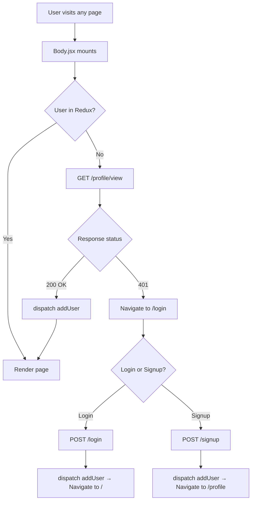
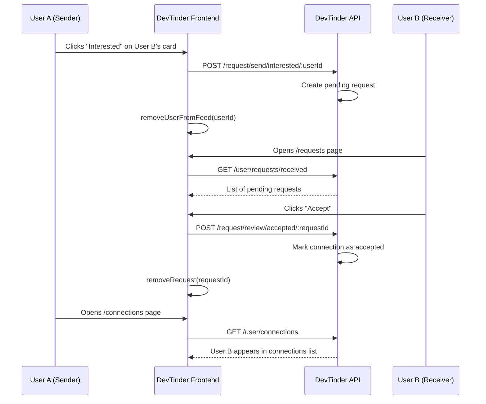

# DevTinder Web

A full-stack developer networking web application inspired by Tinder — built for developers to discover peers, send connection requests, and grow their professional network. This repository contains the **frontend** client built with React, Redux, and Tailwind CSS, which communicates with a REST API backend over HTTP with cookie-based authentication.

---

## Table of Contents

- [Overview](#overview)
- [Features](#features)
- [Tech Stack](#tech-stack)
- [Project Structure](#project-structure)
- [Prerequisites](#prerequisites)
- [Installation & Setup](#installation--setup)
- [Environment Configuration](#environment-configuration)
- [Application Routes](#application-routes)
- [API Integration](#api-integration)
- [State Management (Redux)](#state-management-redux)
- [Application Workflow](#application-workflow)
- [Component Breakdown](#component-breakdown)
- [Planned Features](#planned-features)
- [Resume Points](#resume-points)

---

## Overview

**DevTinder** is a social platform where developers can:

1. **Sign up / Log in** with email and password
2. **Browse a feed** of developer profiles one at a time
3. **Express interest or ignore** profiles (similar to swipe right/left)
4. **Receive and review** incoming connection requests
5. **View accepted connections** and manage their profile

The frontend is a Single Page Application (SPA) that uses **React Router** for navigation, **Redux Toolkit** for global state, and **Axios** for API communication. All authenticated requests use `withCredentials: true` to send session cookies to the backend.

---

## Features

| Feature | Description |
|---------|-------------|
| **Authentication** | Login and signup with email/password; session managed via HTTP cookies |
| **Protected Routes** | Unauthenticated users are redirected to `/login` on 401 responses |
| **Developer Feed** | Displays one profile at a time from a curated list of users |
| **Interest / Ignore** | Send connection requests or skip profiles directly from the feed |
| **Profile Management** | Edit name, photo, age, gender, and bio with live preview |
| **Connection Requests** | Accept or reject incoming requests from other developers |
| **Connections List** | View all accepted connections with profile details |
| **Responsive UI** | Built with Tailwind CSS and DaisyUI component library |

---

## Tech Stack

| Layer | Technology |
|-------|------------|
| **Framework** | React 19 |
| **Build Tool** | Vite 8 |
| **Routing** | React Router DOM v7 |
| **State Management** | Redux Toolkit + React-Redux |
| **HTTP Client** | Axios |
| **Styling** | Tailwind CSS v4, DaisyUI |
| **Compiler** | React Compiler (via Babel plugin) |
| **Linting** | ESLint |

---

## Project Structure

```
DevTinder-Web/
├── public/
│   └── icons.svg
├── src/
│   ├── components/
│   │   ├── Body.jsx          # Layout wrapper, auth check on mount
│   │   ├── NavBar.jsx        # Top navigation, user menu, logout
│   │   ├── Login.jsx         # Login & signup forms
│   │   ├── Feed.jsx          # Developer discovery feed
│   │   ├── UserCard.jsx      # Reusable profile card (feed & preview)
│   │   ├── Profile.jsx       # Profile page wrapper
│   │   ├── EditProfile.jsx   # Profile edit form with live preview
│   │   ├── Connections.jsx   # List of accepted connections
│   │   ├── Requests.jsx      # Incoming connection requests
│   │   └── Footer.jsx        # Footer component (optional)
│   ├── utils/
│   │   ├── appStore.js       # Redux store configuration
│   │   ├── constants.js      # Backend API base URL
│   │   ├── userSlice.js      # Authenticated user state
│   │   ├── feedSlice.js      # Feed profiles state
│   │   ├── conectionSlice.js # Connections state
│   │   └── requestSlice.js   # Pending requests state
│   ├── App.jsx               # Root component, routes, Redux provider
│   ├── main.jsx              # React DOM entry point
│   └── index.css             # Global styles & Tailwind imports
├── index.html
├── vite.config.js
├── package.json
└── README.md
```

---

## Prerequisites

Before running this project, ensure you have:

- **Node.js** (v18 or higher recommended)
- **npm** or **yarn**
- **DevTinder Backend API** running on `http://localhost:3000` (separate repository)

---

## Installation & Setup

### 1. Clone the repository

```bash
git clone https://github.com/<your-username>/DevTinder-Web.git
cd DevTinder-Web
```

### 2. Install dependencies

```bash
npm install
```

### 3. Start the backend server

Make sure the DevTinder backend API is running on port `3000`. Refer to the backend repository for setup instructions.

### 4. Start the development server

```bash
npm run dev
```

The app will be available at `http://localhost:5173` (default Vite port).

### 5. Build for production

```bash
npm run build
npm run preview   # Preview production build locally
```

---

## Environment Configuration

The backend API URL is defined in `src/utils/constants.js`:

```javascript
export const BaseURL = "http://localhost:3000";
```

Update this value when deploying to production or pointing to a different backend instance.

---

## Application Routes

| Route | Component | Access | Description |
|-------|-----------|--------|-------------|
| `/` | `Feed` | Authenticated | Main feed — browse developer profiles |
| `/login` | `Login` | Public | Login and signup page |
| `/profile` | `Profile` | Authenticated | Edit user profile |
| `/connections` | `Connections` | Authenticated | View accepted connections |
| `/requests` | `Requests` | Authenticated | Review incoming connection requests |

All routes are nested under the `Body` layout, which renders the `NavBar` and checks authentication on every page load.

---

## API Integration

All API calls use **Axios** with `withCredentials: true` for cookie-based session authentication.

| Method | Endpoint | Purpose |
|--------|----------|---------|
| `POST` | `/login` | Authenticate user |
| `POST` | `/signup` | Register new user |
| `POST` | `/logout` | End session |
| `GET` | `/profile/view` | Fetch logged-in user profile |
| `PATCH` | `/profile/edit` | Update profile fields |
| `GET` | `/feed` | Get list of profiles to browse |
| `POST` | `/request/send/:status/:userId` | Send interest (`interested`) or ignore (`ignored`) |
| `GET` | `/user/requests/received` | Fetch pending incoming requests |
| `POST` | `/request/review/:status/:requestId` | Accept (`accepted`) or reject (`rejected`) a request |
| `GET` | `/user/connections` | Fetch all accepted connections |

---

## State Management (Redux)

The app uses **Redux Toolkit** with four slices:

| Slice | State Shape | Key Actions |
|-------|-------------|-------------|
| `user` | `User object \| null` | `addUser`, `removeUser` |
| `feed` | `User[] \| null` | `addFeed`, `removeUserFromFeed` |
| `connections` | `User[] \| null` | `addConnections`, `removeConnections` |
| `requests` | `Request[] \| null` | `addRequests`, `removeRequest` |

The Redux store is provided at the app root via `<Provider store={appstore}>` in `App.jsx`.

---

## Application Workflow

### High-Level Flow

```
User opens app
      │
      ▼
Body.jsx checks session ──GET /profile/view──► Backend
      │                                              │
      ├── 401 Unauthorized ──► Redirect to /login    │
      │                                              │
      └── 200 OK ──► Store user in Redux ◄───────────┘
      │
      ▼
User lands on Feed (/)
      │
      ▼
GET /feed ──► Display first profile in UserCard
      │
      ├── "Interested" ──POST /request/send/interested/:id──► Remove from feed
      │
      └── "Ignore"     ──POST /request/send/ignored/:id────► Remove from feed
```

### Authentication Flow



### Connection Request Flow



### Feed Interaction Flow

1. **Feed loads** — `Feed.jsx` fetches profiles via `GET /feed` and stores them in Redux.
2. **One card at a time** — Only the first profile in the feed array is rendered via `UserCard`.
3. **User action** — Clicking **Interested** or **Ignore** sends a POST request and removes that user from the local feed state.
4. **Next profile** — The next user in the array automatically becomes visible.
5. **Empty feed** — When no profiles remain, a "No new users found" message is shown.

### Profile Edit Flow

1. User navigates to `/profile`.
2. `EditProfile.jsx` pre-fills the form with current Redux user data.
3. A live `UserCard` preview updates as the user types.
4. On **Save**, a `PATCH /profile/edit` request updates the backend.
5. Redux user state is updated and a success toast is displayed.

---

## Component Breakdown

| Component | Responsibility |
|-----------|----------------|
| **App.jsx** | Wraps app with Redux Provider and React Router; defines all routes |
| **Body.jsx** | Layout shell with NavBar; validates session on mount |
| **NavBar.jsx** | Brand link, welcome message, avatar dropdown, logout |
| **Login.jsx** | Toggle between login/signup forms; dispatches user to Redux |
| **Feed.jsx** | Fetches and displays developer profiles for discovery |
| **UserCard.jsx** | Renders profile card with Interested/Ignore action buttons |
| **EditProfile.jsx** | Form to update profile with real-time card preview |
| **Requests.jsx** | Lists incoming requests with Accept/Reject buttons |
| **Connections.jsx** | Displays all mutually accepted developer connections |

---

## Planned Features

The following routes and components are prepared but currently commented out in the codebase:

- **Real-time Chat** — `/chat/:targetUserId` route and Chat component
- **Premium Subscription** — `/premium` route and Premium component

---

## Resume Points

Use these bullet points when adding **DevTinder** to your resume. Pick 3–5 that best match the role you are applying for.

### Project Description (one-liner)

> Built a developer networking web app (Tinder-style) enabling users to discover peers, send connection requests, and manage professional profiles — full-stack SPA with React, Redux, and REST API integration.

### Technical Bullet Points

- Developed a **React 19 SPA** with **Vite**, implementing client-side routing via **React Router v7** and global state management using **Redux Toolkit** across 4 feature slices (user, feed, connections, requests).

- Implemented **cookie-based authentication** with Axios interceptors and protected route logic; handled session validation, login/signup flows, and automatic redirect on 401 unauthorized responses.

- Built a **Tinder-style developer feed** that fetches profiles from a REST API, displays one card at a time, and supports interest/ignore actions with optimistic UI updates via Redux.

- Designed and integrated **10+ REST API endpoints** for authentication, profile management, connection requests, and feed discovery using Axios with credential-based session handling.

- Created a **profile management module** with live preview, form validation, PATCH updates, and toast notifications using **Tailwind CSS** and **DaisyUI** components.

- Architected a **modular component structure** (Feed, UserCard, Requests, Connections, EditProfile) with reusable UI patterns and separation of concerns between presentation and state logic.

- Applied **React Compiler** optimizations and modern React patterns including hooks (`useState`, `useEffect`, `useSelector`, `useDispatch`) for efficient re-renders and clean state flow.

- Styled a responsive, accessible UI using **Tailwind CSS v4** and **DaisyUI**, including navbar dropdowns, card layouts, form controls, and toast alerts.

### Impact-Oriented Bullet Points (customize with your metrics)

- Engineered end-to-end user flows for signup → profile setup → feed discovery → connection matching, mirroring real-world social networking product patterns.

- Reduced redundant API calls by caching feed and user data in Redux store and skipping re-fetches when state is already populated.

- Collaborated with a **Node.js/Express backend** (REST API) implementing JWT/cookie session auth, MongoDB data persistence, and connection request state machines.

### Skills to List Alongside This Project

`React` · `Redux Toolkit` · `JavaScript (ES6+)` · `React Router` · `Axios` · `REST APIs` · `Tailwind CSS` · `Vite` · `Git` · `Responsive Web Design`

---

## Scripts

| Command | Description |
|---------|-------------|
| `npm run dev` | Start Vite development server |
| `npm run build` | Build for production |
| `npm run preview` | Preview production build |
| `npm run lint` | Run ESLint |

---

## License

This project is for educational and portfolio purposes.

---

## Author

**Your Name** — [GitHub](https://github.com/your-username) · [LinkedIn](https://linkedin.com/in/your-profile)
